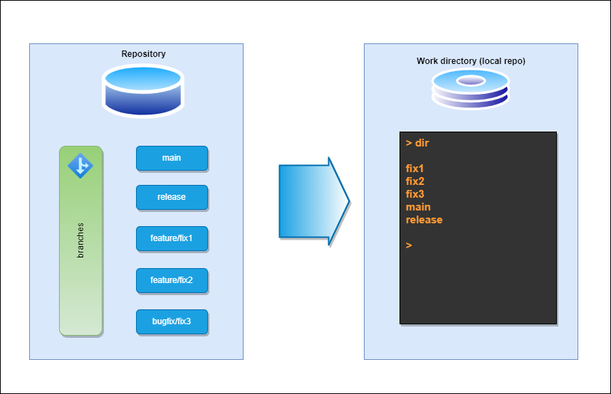

# Git worktrees like I like them

I like my worktrees in my development directory like this:



The following works at any repo. It works by creating an empty detached branc
named `root`. Remove all local files (but not the .git dir of course). Make sure
that everything you need has been committed and pushed

```text
> git switch --orphan root
> git clean -f -x -d
> git commit --allow-empty -m "Initial commit on orphan branch"
> git push -u origin root
```

Then we just add the worktrees in subfolders. I forego the feature directory as
part of the structure, as I never have same name for features or bugfixes or
similar, and it makes it much easier to compare

```text
> git worktree add main main
> git worktree add release release
> git worktree add feature1 feature/feature1
> git worktree add feature2 feature/feature2
```

This is a great way to create clean work branches for code that is never to be
merged to main branch (I prefix them with scratch/username usually, but scratch
branches can also be branched from main or other branches).
