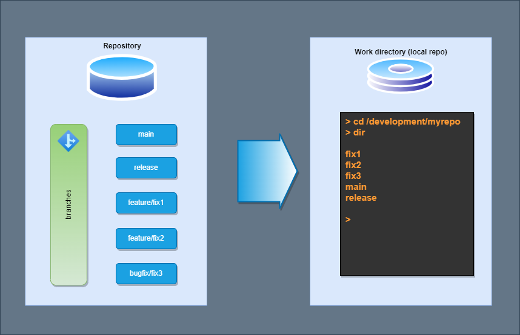

# Git worktrees like I like them

I like my worktrees in my development directory like this:



The following works at any repo. It works by creating an empty detached branc
named `root`. Remove all local files (but not the .git dir of course). Make sure
that everything you need has been committed and pushed

```text
> git switch --orphan root
> git clean -f -x -d
> git commit --allow-empty -m "Initial commit on orphan branch" 
> git push -u origin root
```

If you want to do this on several machines (or local repos), you might as well have the orphaned root available in the remote repo, but there is no need for it.

```text
> git commit --allow-empty -m "Initial commit on orphan branch" 
> git push -u origin root
```

Then we just add the worktrees in subdirectories. I forego the feature directory as
part of the structure, as I never have same name for features or bugfixes or
similar, and it makes it much easier to compare

```text
> git worktree add main main
> git worktree add release release
> git worktree add fix1 feature/fix1
> git worktree add fix2 feature/fix2
> git worktree add fix3 bugfix/fix3
```

This is a great way to create clean work branches for code that is never to be
merged to main branch (I prefix them with scratch/username usually, but scratch
branches can also be branched from main or other branches).

How to return to a normal local repo. Make sure you have everything committed
and pushed.

```text
> git worktree remove main
> git worktree remove release
> git worktree remove fix1
> git worktree remove fix2
> git worktree remove fix3
> git switch main
```

If you did create the orphaned root branch on the repo, you may want to delete it

```text
> git branch -D root
> git push origin -d root
```
